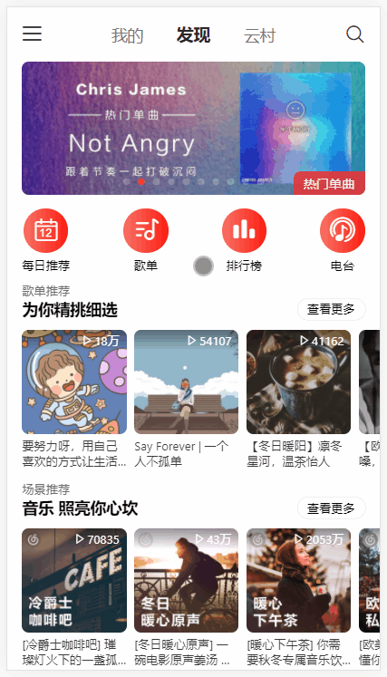
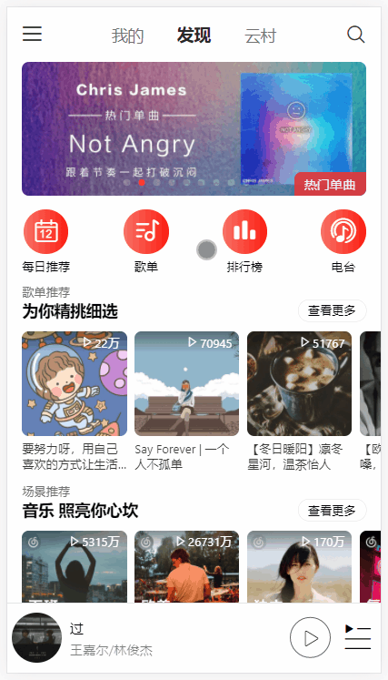
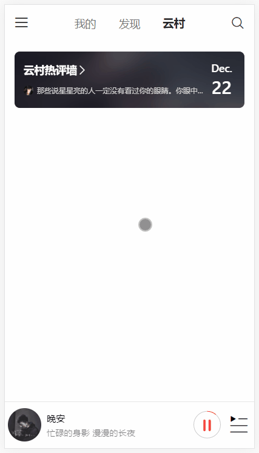

# moonlite-music 音乐播放站点 移动端

  
  
  
  

## 项目线上地址	http://121.196.155.101:3000

**请使用移动端浏览器预览，如果使用PC端，请切换到Chrome的移动端调试模式**

本项目的音频可视化效果用到了 `AudioContext`接口的 `createMediaElementSource`方法，该方法在iOS上存在[**BUG**](https://stackoverflow.com/questions/58306894/has-ios13-broken-audio-tags-used-as-audio-buffers-connected-to-the-audio-conte)，会导致歌曲无法播放，因此针对iOS系统，去除了音频可视化效果，**建议在Android系统上进行预览**

## 项目说明

前端使用React进行开发（全面拥抱Hooks），状态管理库使用Mobx，并用vw布局进行移动端适配

后端使用开源项目[NeteaseCloudMusicApi](https://github.com/Binaryify/NeteaseCloudMusicApi)进行搭建

本项目UI参考网易云音乐Android App 7.x版本，除Swiper外，未使用第三方UI组件

主要动画效果均为手动实现，包括但不局限于：

* 下拉刷新
* 上拉加载
* 滑动输入条Slider
* 类似marquee的横向无限滚动展示组件Ticker
* 抽屉Drawer
* 全局提示Toast
* 对话框Dialog
* 验证码输入框
* ......

部分动画效果参考了：

* kurodaakira-jp/cloud-music-master (使用Vue的一个高仿网易云音乐项目，原作者貌似改名了，未找到项目地址)

* [ant-design](https://github.com/ant-design/ant-design)

* [react-ticker](https://github.com/AndreasFaust/react-ticker)

* [react-components](https://github.com/clancysong/react-components)

* [cursor-vcode](https://github.com/useryangtao/cursor-vcode)

* [Web Audio在音频可视化中的应用](https://juejin.cn/post/6844903953130323976)

本项目的音频可视化只是将连续的音频点进行平滑连接，但在起始和末尾相连的地方不够平整，更好的方法是用傅里叶变换进行采样，再进行平滑处理，具体可见网易云音乐大前端团队的文章——[Android 音频可视化](https://juejin.cn/post/6873253309944168456)

## 功能预览

